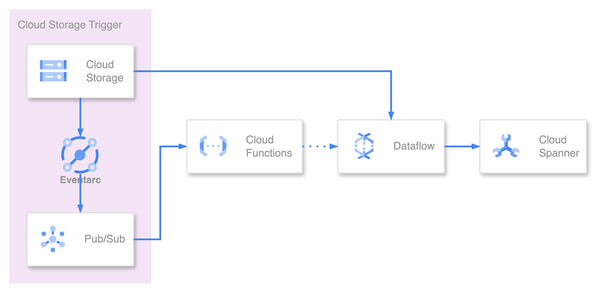

# Terraform Module: Event-Driven batch Dataflow that imports data from Cloud Storage (GCS) to Cloud Spanner

## What is this?
This Terraform module sets up a workflow where files stored in Cloud Storage trigger events in Eventarc, which then processes the files and stores the data in Spanner.

## Architecture

1. File is stored in Cloud Storage
2. Receive event from Eventarc
3. If the received file is `spanner-export.json`
4. Get Cloud API access token and
5. POST to Dataflow creation API
6. Read the `.avro` file in the same hierarchy as the `spanner-export.json` file and store it in Spanner

## `spanner-export.json`
```json
{
    "tables": [
        {
            "name": "TableName",
            "dataFiles": [
                "TableName-000000000000.avro",
                "TableName-000000000001.avro",
                "TableName-[0-9]{12}.avro"
            ]
        }
    ],
    "dialect":"GOOGLE_STANDARD_SQL"
}
```
